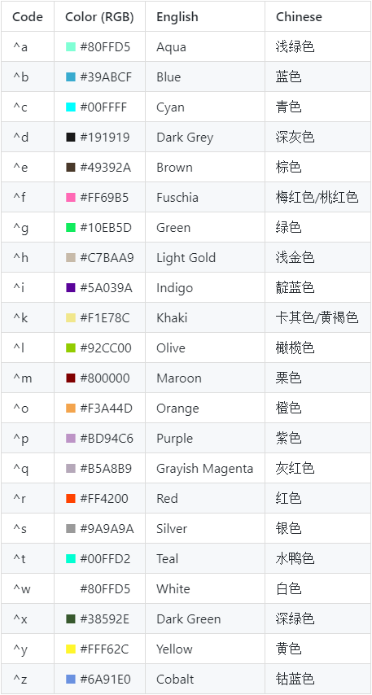

# Color defines - 色彩定义
`Exemple: {^w} {^E} {^b} {^r} {^H} {^W} {^S} {^y} {^g} {^R}`

**Color code from [WanezToolsGD](https://github.com/WareBare/WanezToolsGD)**

*Note: GitHub Markdown not support color text! Pls refer to screenshot.*

Code | Color (RGB)                           | English         | Chinese
-----|--------------------------------------|-----------------|--------
^a   | <font color=#80FFD5>■</font> #80FFD5 | Aqua            | 浅绿色
^b   | <font color=#39ABCF>■</font> #39ABCF | Blue            | 蓝色
^c   | <font color=#00FFFF>■</font> #00FFFF | Cyan            | 青色
^d   | <font color=#191919>■</font> #191919 | Dark Grey       | 深灰色
^e   | <font color=#49392A>■</font> #49392A | Brown           | 棕色
^f   | <font color=#FF69B5>■</font> #FF69B5 | Fuschia         | 梅红色/桃红色
^g   | <font color=#10EB5D>■</font> #10EB5D | Green           | 绿色
^h   | <font color=#C7BAA9>■</font> #C7BAA9 | Light Gold      | 浅金色
^i   | <font color=#5A039A>■</font> #5A039A | Indigo          | 靛蓝色
^k   | <font color=#F1E78C>■</font> #F1E78C | Khaki           | 卡其色/黄褐色
^l   | <font color=#92CC00>■</font> #92CC00 | Olive           | 橄榄色
^m   | <font color=#800000>■</font> #800000 | Maroon          | 栗色
^o   | <font color=#F3A44D>■</font> #F3A44D | Orange          | 橙色
^p   | <font color=#BD94C6>■</font> #BD94C6 | Purple          | 紫色
^q   | <font color=#B5A8B9>■</font> #B5A8B9 | Grayish Magenta | 灰红色
^r   | <font color=#FF4200>■</font> #FF4200 | Red             | 红色
^s   | <font color=#9A9A9A>■</font> #9A9A9A | Silver          | 银色
^t   | <font color=#00FFD2>■</font> #00FFD2 | Teal            | 水鸭色
^w   | <font color=#FFFFFF>■</font> #80FFD5 | White           | 白色
^x   | <font color=#38592E>■</font> #38592E | Dark Green      | 深绿色
^y   | <font color=#FFF62C>■</font> #FFF62C | Yellow          | 黄色
^z   | <font color=#6A91E0>■</font> #6A91E0 | Cobalt          | 钴蓝色

## Color table screenshot


# String defines - 字符串定义
Code | English                   | Chinese
-----|---------------------------|--------
%s   | String (from tag)         | 字符串
%S   | Capital String (from tag) | 大写字符串
%f   | Rounded Float             | 取整浮点数
%g   | Float                     | 浮点数
%d   | Integer                   | 整数
%a   | Adjective                 | 形容词
%A   | Capital Adjective         | 大写形容词
%t   | Text                      | 文本
%z   | Time (seconds)            | 时间（秒）

```
Exemple: CharacterLevelDescription={%s0} - [Level {%d1}] => Soldier - [Level 35]
```
