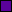
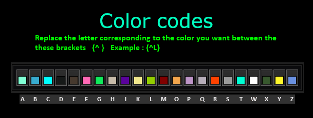

# Color defines - 色彩定义
**Replace the letter corresponding to the color you want between these brackets {^ }**  
***Note**: Code letters are case-insensitive*  

***Example**: {^L},{^l} =>  Olive*

Code | Color (RGB)                      | English         | Chinese
-----|----------------------------------|-----------------|--------
a    |  #81FFD5 | Aqua            | 浅绿色
b    |  #38ABCF | Blue            | 蓝色
c    |  #00FFFF | Cyan            | 青色
d    |  #161918 | Dark Grey       | 深灰色
e    |  #46392e | Brown           | 棕色
f    |  #FF68B5 | Fuschia         | 梅红色/桃红色
g    |  #10EB5C | Green           | 绿色
h    |  #C7BBA9 | Light Gold      | 浅金色
i    |  #5A029B | Indigo          | 靛蓝色
k    |  #F1E78D | Khaki           | 卡其色/黄褐色
l    |  #93CD00 | Olive           | 橄榄色
m    |  #810000 | Maroon          | 栗色
o    |  #F3A54C | Orange          | 橙色
p    |  #BD95C7 | Purple          | 紫色
q    |  #B6ADB9 | Grayish Magenta | 灰红色
r    |  #FF4200 | Red             | 红色
s    |  #9B9B9B | Silver          | 银色
t    |  #00FFD3 | Teal            | 水鸭色
w    |  #FFFFFF | White           | 白色
x    |  #38582E | Dark Green      | 深绿色
y    |  #FFF72C | Yellow          | 黄色
z    |  #6A91E1 | Cobalt          | 钴蓝色

## Color Table

# String defines - 字符串定义

***Exemple:** CharacterLevelDescription={%s0} - [Level {%d1}] => Soldier - [Level 35]*

Code | English                   | Chinese
-----|---------------------------|--------
%s   | String (from tag)         | 字符串
%S   | Capital String (from tag) | 大写字符串
%f   | Rounded Float             | 取整浮点数
%g   | Float                     | 浮点数
%d   | Integer                   | 整数
%a   | Adjective                 | 形容词
%A   | Capital Adjective         | 大写形容词
%t   | Text                      | 文本
%z   | Time (seconds)            | 时间（秒）
